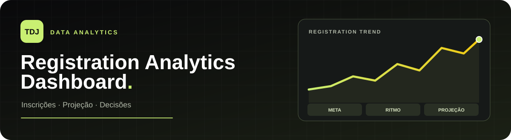
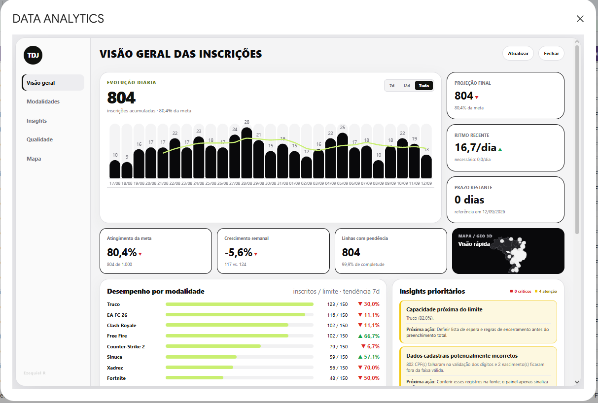
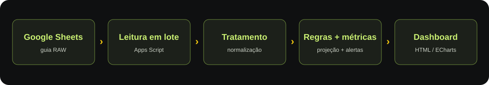
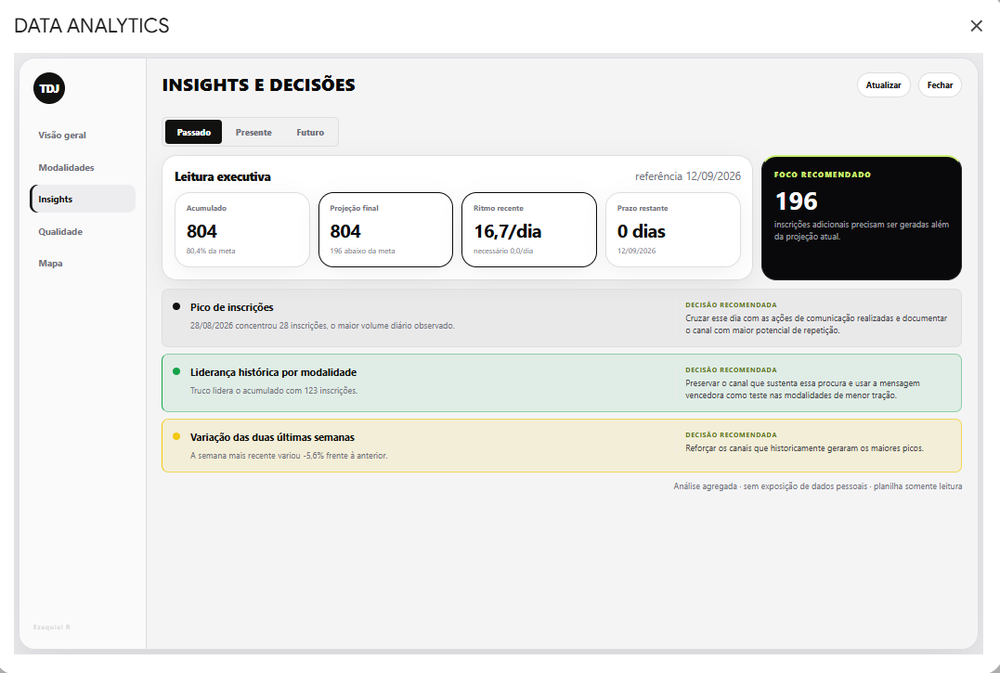
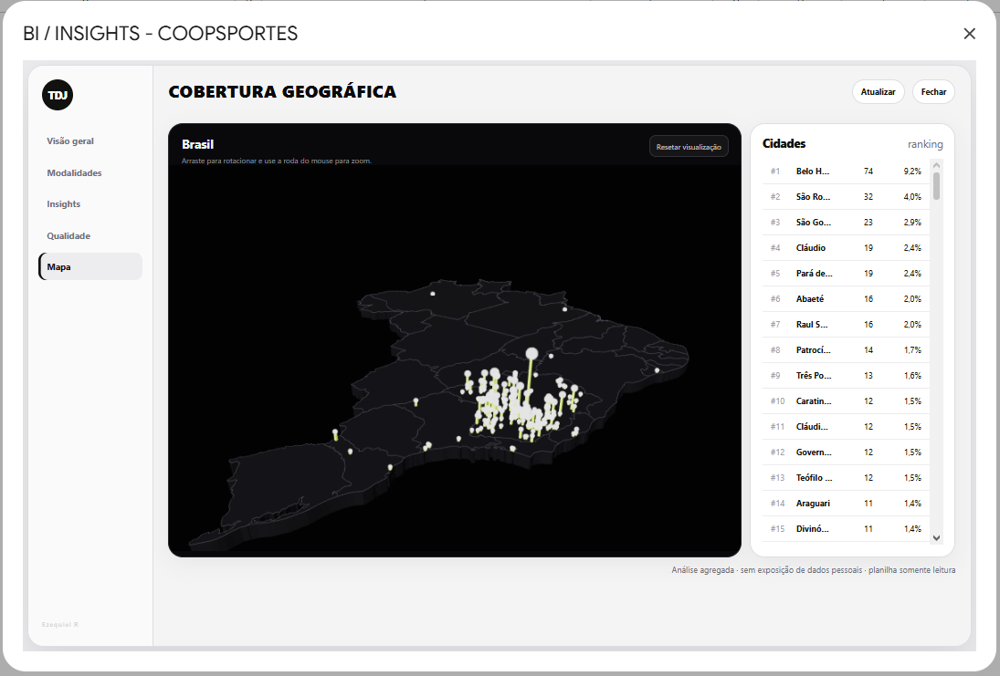

<p align="center">
  
</p>

<p align="center">
  <strong>Google Apps Script · JavaScript · HTML · CSS · Apache ECharts · ECharts GL · GeoJSON</strong>
</p>

Dashboard de acompanhamento de inscrições desenvolvido para a **TDJ Corporate**, no contexto do **Coopsportes Digital 2026**. Ele lê uma planilha Google, consolida indicadores e transforma a evolução das inscrições em alertas e recomendações para a campanha.

> **Demonstração:** os dados mostrados nas imagens foram alterados para preservar a privacidade dos participantes. Os números das capturas são ilustrativos e não representam o resultado oficial do evento.

## O problema

Acompanhar somente a quantidade acumulada de inscrições não respondia às perguntas operacionais: estamos no ritmo necessário para a meta? Quais modalidades precisam de divulgação? Onde há concentração geográfica? Existem cadastros pendentes que exigem revisão?

O objetivo do projeto foi reunir essas respostas em um painel acessível diretamente na planilha usada pela organização, com atualização sob demanda e leitura por **passado, presente e futuro**.

## Visão geral

<p align="center"></p>

O painel apresenta inscrições acumuladas, percentual da meta, evolução diária, comparação semanal, ritmo recente, capacidade por modalidade e alertas prioritários. É possível alternar o gráfico entre 7 dias, 12 dias e o período completo.

## Como os dados viram decisões

<p align="center"></p>

1. **Coleta:** uma leitura em lote da guia RAW carrega os registros da planilha.
2. **Tratamento:** cabeçalhos e modalidades são normalizados; registros com carimbo preenchido entram na análise.
3. **Agregação:** os registros são agrupados por dia, modalidade, cooperativa, cidade, gênero e faixa etária.
4. **Análise:** regras calculam metas, ritmo, projeção, capacidade e qualidade cadastral.
5. **Apresentação:** o Apps Script monta a interface em HTML/CSS/JavaScript; o botão **Atualizar** solicita novos dados via `google.script.run`.

### Passado, presente e futuro

<p align="center"></p>

| Horizonte | O que o painel mostra | Exemplo de uso |
| --- | --- | --- |
| **Passado** | Picos diários, modalidades líderes e variação entre duas janelas completas de sete dias. | Identificar ações de divulgação associadas aos melhores períodos. |
| **Presente** | Atingimento da meta, desvio frente ao ritmo esperado, modalidades com baixa procura, capacidade e pendências cadastrais. | Direcionar a equipe para prioridades atuais. |
| **Futuro** | Projeção linear do total, inscrições diárias necessárias e modalidades que exigem mobilização. | Ajustar o esforço de divulgação antes do encerramento. |

As principais fórmulas do painel são:

```text
ritmo recente       = inscrições em dias completos da janela / dias completos da janela
projeção final      = inscrições acumuladas + ritmo recente × dias restantes
ritmo necessário    = max(0, meta − inscrições acumuladas) / dias restantes
atingimento da meta = inscrições acumuladas / meta
```

Quando não há dias restantes, o ritmo necessário é exibido como zero. A projeção é uma **extrapolação do ritmo recente**, não um modelo estatístico nem uma garantia de resultado.

### Cobertura geográfica em 3D

<p align="center"></p>

O mapa cruza o ranking de cidades com coordenadas obtidas por geocodificação no Apps Script. As coordenadas são guardadas em `PropertiesService` para evitar consultas repetidas; falhas de geocodificação têm cache temporário de 24 horas. A visualização usa **Apache ECharts**, **ECharts GL** e um **GeoJSON do Brasil** carregado externamente.

### Qualidade dos dados

O painel sinaliza campos ausentes, formato de e-mail e telefone, dígitos verificadores de CPF, idade e nascimento inconsistentes, possíveis inscrições duplicadas, IDs reutilizados e casos de menores em inscrição direta sem termo. As ocorrências são associadas às linhas da planilha para revisão. **O BI sinaliza; ele não exclui nem corrige inscrições automaticamente.**

## Resultado para a operação

O projeto reuniu em uma única interface a meta, o ritmo recente, a projeção, a capacidade das modalidades e a origem das inscrições. Isso permitiu à equipe identificar desvios mais cedo e orientar a divulgação para modalidades e regiões com menor participação.

**Não há, neste repositório, uma medição isolada do aumento de inscrições causado pelo dashboard.** O resultado documentado é a melhoria da visibilidade e da capacidade de ajustar as ações durante a campanha. Os números exibidos nas capturas são exemplos com dados alterados.

## Executar em uma planilha

1. Abra a planilha de inscrições e acesse **Extensões → Apps Script**.
2. Adicione o conteúdo de [`BI.gs`](BI.gs) a um arquivo `.gs` do projeto vinculado à planilha.
3. Confira o nome da guia RAW (`Respostas ao formulário 1`) e ajuste as constantes de configuração no início do arquivo, se necessário.
4. Execute `instalarMenuBiInsightsCoopsportes` uma vez e autorize as permissões solicitadas.
5. Recarregue a planilha e use **BI → Abrir painel executivo**. O botão **Atualizar** recalcula os indicadores.

O script foi pensado para coexistir com um `onOpen` já existente: instala um gatilho próprio para adicionar o menu.

### Entrada e parâmetros

A guia RAW precisa, no mínimo, dos cabeçalhos `Carimbo de data/hora`, `Qual modalidade você vai jogar?`, `Idade` e `Faixa etária`. Outros cabeçalhos do formulário, como cidade, cooperativa, nome, CPF e contato, alimentam as análises e validações; a ausência deles reduz a cobertura da análise de qualidade.

Opcionalmente, crie a guia `CONFIG_BI` com a chave na coluna A e o valor na coluna B:

| Chave | Exemplo |
| --- | --- |
| `Início das inscrições` | `17/08/2026` |
| `Encerramento das inscrições` | `12/09/2026` |
| `Meta geral` | `1000` |
| `Máximo por modalidade` | `150` |

Sem essa guia, o código usa esses valores como padrão. Para outro evento, ajuste também a lista de modalidades no início de [`BI.gs`](BI.gs). O projeto foi desenvolvido para os nomes de campos do formulário do Coopsportes; outros formulários exigem adaptar o mapeamento de cabeçalhos.

## Estrutura

```text
tdj-analytics-dashboard/
├── BI.gs                    # leitura, regras de negócio e interface do Apps Script
├── README.md
└── assets/
    ├── header.svg
    ├── data-flow.svg
    ├── dashboard-overview.png
    ├── insights.png
    └── geographic-coverage.png
```

## Limitações conhecidas

- A previsão linear reage ao ritmo recente e pode variar com ações de campanha, sazonalidade e eventos pontuais.
- O total considera linhas com carimbo preenchido, mesmo se a data estiver fora do intervalo configurado; revise a base antes de interpretar o atingimento da campanha.
- O mapa requer acesso às bibliotecas externas e ao GeoJSON; o arquivo GeoJSON é referenciado pela branch `main` e pode mudar.
- A aplicação depende do ambiente do Google Planilhas/Apps Script para execução completa. A sintaxe do arquivo e do JavaScript embutido foi verificada localmente; não há suíte de testes automatizada neste pacote.

## Privacidade

O código publicado não inclui a planilha de inscrições. As capturas usam dados alterados e exibem apenas informações agregadas. Antes de reutilizar ou compartilhar o projeto, confira os dados e as imagens da sua própria planilha.

---

Desenvolvido por **Ezequiel Gomes Rocha** para a **TDJ Corporate**.
